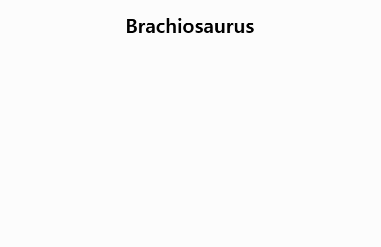

# [Dinosaur](/README.md#dinosaur)

For my son


### \<List>

- [Brachiosaurus (2024.11.22)](#brachiosaurus-20241122)


## [Brachiosaurus (2024.11.22)](#list)

- My son really love it

  

- Future improvements
  - Add sound effects
  - Add background
- Code
  <details>
    <summary>brachiosaurus.html</summary>

    ```html
    <!DOCTYPE html>

    <html lang="en">

    <head>
        ……
        <title>Brachiosaurus for My Son</title>
        <link rel="stylesheet" href="brachiosaurus.css">
        <script defer src="brachiosaurus.js" type="module"></script>
    </head>

    <body>
        <h1>Brachiosaurus</h1>
        <div class="container">
            <object id="brachio-svg" data="brachiosaurus.svg" type="image/svg+xml"></object>
        </div>
    </body>

    </html>
    ```
  </details>
  <details>
    <summary>brachiosaurus.svg</summary>

    ```svg
    <svg xmlns="http://www.w3.org/2000/svg" viewBox="0 0 300 200">
        <rect id="head" x="70" y="20" width="40" height="30" fill="green"/>
        <circle id="eye" cx="100" cy="30" r="5" fill="#000000"/>
        <rect id="neck" x="90" y="40" width="20" height="70" fill="green"/>

        <rect id="body" x="90" y="100" width="130" height="30" fill="green"/>
        <polygon id="tail" points="219,100 219,120 280,130" fill="green"/>

        <rect id="leg1" x="90" y="120" width="20" height="50" fill="green"/>
        <rect id="leg2" x="120" y="120" width="20" height="50" fill="green"/>
        <rect id="leg3" x="170" y="120" width="20" height="50" fill="green"/>
        <rect id="leg4" x="200" y="120" width="20" height="50" fill="green"/>
    </svg>
    ```
  </details>
  <details>
    <summary>brachiosaurus.css</summary>

    ```css
    body {
        margin: 0;
        overflow: hidden;
    }

    h1 {
        text-align: center;
        font-size: 2.5rem;
    }

    #brachio-svg {
        width: 80%;
        height: auto;
        animation: move 5s ease-in infinite;
    }

    @keyframes move {
        from { transform: translateX(105%); }
        to { transform: translateX(-105%); }
    }
    ```
  </details>
  <details>
    <summary>brachiosaurus.ts</summary>

    ```ts
    // Constant for the object ID
    const SVG_OBJECT_ID = 'brachio-svg';

    // Constants for SVG element IDs
    const LEG1_ID = 'leg1';
    const LEG2_ID = 'leg2';
    const LEG3_ID = 'leg3';
    const LEG4_ID = 'leg4';
    const HEAD_ID = 'head';
    const EYE_ID = 'eye';
    const NECK_ID = 'neck';
    ```
    ```ts
    document.addEventListener('DOMContentLoaded', () => {
        const svgObject = document.getElementById(SVG_OBJECT_ID) as HTMLObjectElement;

        svgObject.addEventListener('load', () => {
            const svgDoc = svgObject.contentDocument;
            if (svgDoc) {
                // Call functions to handle animations
                animateLegs(svgDoc);
                animateHeadNeck(svgDoc);
            }
        });
    });
    ```
    ```ts
    /**
     * Animates the legs of the Brachiosaurus.
     * @param svgDoc The SVG document containing the elements.
     */
    function animateLegs(svgDoc: Document): void {
        const leg1 = svgDoc.getElementById(LEG1_ID);
        const leg2 = svgDoc.getElementById(LEG2_ID);
        const leg3 = svgDoc.getElementById(LEG3_ID);
        const leg4 = svgDoc.getElementById(LEG4_ID);

        if (leg1 && leg2 && leg3 && leg4) {
            // Animate leg1 and leg3 simultaneously
            [leg1, leg3].forEach((leg) => {
                leg.animate(
                    [
                        { transform: 'translateX(0)' },     // Original position
                        { transform: 'translateX(1.5%)' },  // Move slightly right
                        { transform: 'translateX(0)' }      // Return to original position
                    ],
                    {
                        duration: 1000,                     // Animation duration in milliseconds
                        iterations: Infinity,               // Infinite loop
                        easing: 'ease-in-out'               // Smooth movement
                    }
                );
            });

            // Animate leg2 and leg4 simultaneously (opposite timing)
            [leg2, leg4].forEach((leg) => {
                leg.animate(
                    [
                        { transform: 'translateX(0)' },     // Original position
                        { transform: 'translateX(-1.5%)' }, // Move slightly left
                        { transform: 'translateX(0)' }      // Return to original position
                    ],
                    {
                        duration: 1000,                     // Animation duration in milliseconds
                        iterations: Infinity,               // Infinite loop
                        easing: 'ease-in-out'               // Smooth movement,
                    }
                );
            });
        }
    }
    ```
    ```ts
    /**
     * Animates the head, eye, and neck of the Brachiosaurus.
     * @param svgDoc The SVG document containing the elements.
     */
    function animateHeadNeck(svgDoc: Document): void {
        const head = svgDoc.getElementById(HEAD_ID);
        const eye = svgDoc.getElementById(EYE_ID);
        const neck = svgDoc.getElementById(NECK_ID);

        if (head && eye && neck) {
            [head, eye, neck].forEach((element) => {
                element.animate(
                    [
                        { transform: 'translateY(0)' },     // Original position
                        { transform: 'translateY(3%)' },    // Move downward by 3%
                        { transform: 'translateY(0)' }      // Return to original position
                    ],
                    {
                        duration: 1000,                     // Animation duration in milliseconds
                        iterations: Infinity,               // Infinite loop
                        easing: 'ease-in-out'               // Smooth movement
                    }
                );
            });
        }
    }
    ```
  </details>
