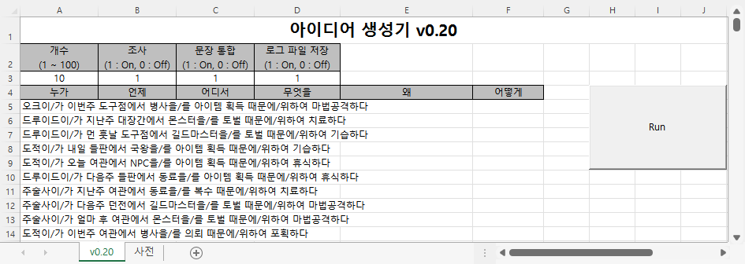
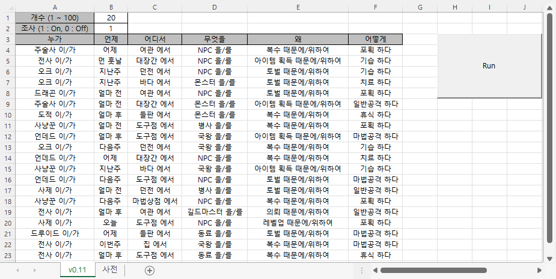
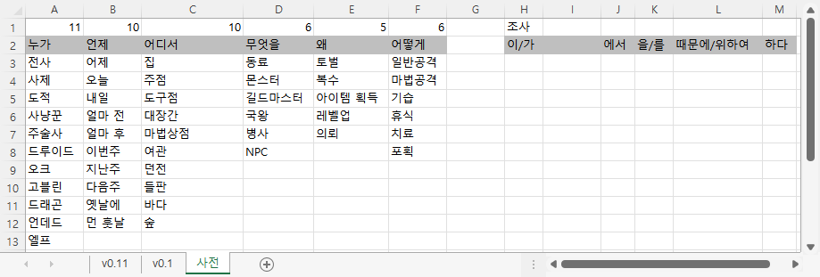
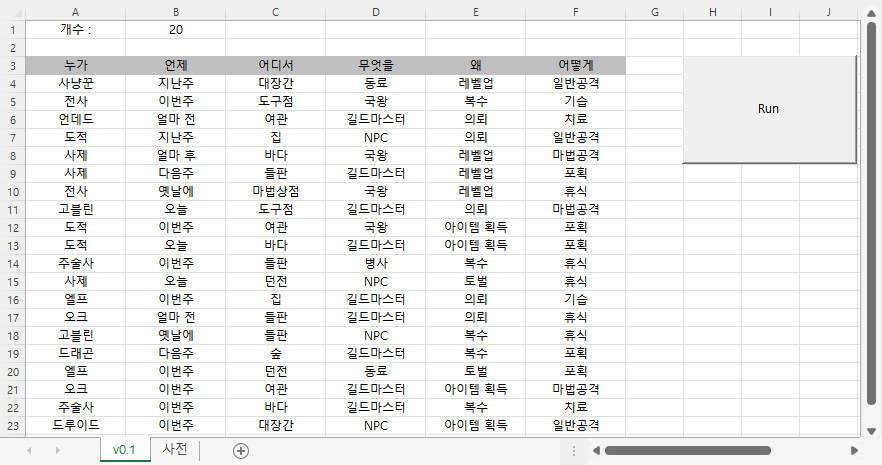
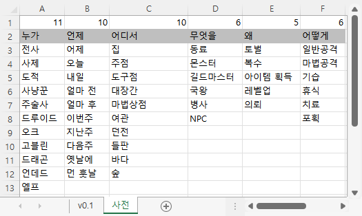

# [Idea Generator]

for my sister who is an aspiring writer


### List

- [Idea Generator v0.20 (2022.06.03)](#idea-generator-v020-20220603)
- [Idea Generator v0.12 (2022.05.20)](#idea-generator-v012-20220520)
- [Idea Generator v0.11 (2022.05.19)](#idea-generator-v011-20220519)
- [Idea Generator v0.1 (2022.05.18)](#idea-generator-v01-20220518)


## [Idea Generator v0.20 (2022.06.03)](#list)



#### GenIdeaLog_2022-06-04.txt (EUC-KR)
```txt
2022-06-04 오후 11:39:05
1 오크이/가 이번주 도구점에서 병사을/를 아이템 획득 때문에/위하여 마법공격하다 
2 드루이드이/가 지난주 대장간에서 몬스터을/를 토벌 때문에/위하여 치료하다 
3 드루이드이/가 먼 훗날 도구점에서 길드마스터을/를 토벌 때문에/위하여 기습하다 
4 도적이/가 내일 들판에서 국왕을/를 아이템 획득 때문에/위하여 기습하다 
5 도적이/가 오늘 여관에서 NPC을/를 아이템 획득 때문에/위하여 휴식하다 
6 드루이드이/가 다음주 들판에서 동료을/를 아이템 획득 때문에/위하여 휴식하다 
7 주술사이/가 지난주 여관에서 동료을/를 복수 때문에/위하여 치료하다 
8 주술사이/가 다음주 던전에서 길드마스터을/를 토벌 때문에/위하여 마법공격하다 
9 주술사이/가 얼마 후 여관에서 몬스터을/를 토벌 때문에/위하여 마법공격하다 
10 도적이/가 이번주 여관에서 병사을/를 의뢰 때문에/위하여 포획하다 
```

#### Mainly changed parts of `IdeaGenerator_v0.20.bas`
```vba
Private Sub GenIdea()

    ……

    ' Parameters
    Dim n As Integer, postp As Integer, integrated As Integer, pick As Integer, save As Integer

    ……
    save = Range("D3")

    ……

    ' Loop for i, j
    Dim i As Integer, j As Integer                                          ' i is recognized as Variant/Double when Dim i, j As Integer
    Dim sentence As String

    For i = 1 To n

        ……

        ' Call RecordLog() for Saving into a separated log file
        If save = 1 Then
            Call RecordLog(i, sentence)
        End If

    Next i

End Sub
```
```vba
' Save sentences into a log file
Private Sub RecordLog(ByRef i As Integer, ByRef sentence As String)

    ' Set log file name
    Dim path As String, timeInfo As String, logSentence As String
    Dim timeInfo1 As Date, timeInfo2 As Date
    timeInfo1 = Date
    timeInfo2 = Time
    timeInfo = timeInfo1 & " " & timeInfo2
    path = ThisWorkbook.path & Application.PathSeparator & "GenIdeaLog_" & timeInfo1 & ".txt"

    Dim fn As Integer
    fn = FreeFile

    ' Record the sentences
    logSentence = i & " " & sentence
    Open path For Append As #fn
        If i = 1 Then                                                       ' when the log file should be initialized
            Print #fn, timeInfo
        End If
        
        Print #fn, logSentence
    Close #fn

End Sub
```


## [Idea Generator v0.12 (2022.05.20)](#list)

- Can print a line as an **integrated sentence** (suggested from my friend *2071*)  
&nbsp;&nbsp;- Can choose if integrate or not  
&nbsp;&nbsp;- Contain postpositions automatically when choose to integrate  
&nbsp;&nbsp;- Change alignment automatically (left / center)  
&nbsp;&nbsp;- Add spaces more naturally when choose to integrate


#### Mainly changed parts of `IdeaGenerator_v0.12.bas`
```vba
Option Explicit
```
```vba
    ……
    ' Parameters
    Dim n, postp, integrated, pick As Integer
    ……
    integrated = Range("D2")

    If integrated = 1 Then
        Range("B2").Value = 1                                               ' an integrated sentence should contain postpositions
        postp = Range("B2")
        Range("A4:F10000").HorizontalAlignment = xlLeft                     ' left alignment when the sentence is integrated
    Else
        Range("A4:F10000").HorizontalAlignment = xlCenter                   ' center alignment when the sentence is not integrated
    End If
    ……
```
```vba
    ……
    ' Loop for i, j
    Dim i, j As Integer
    Dim sentence As String

    For i = 1 To n

        sentence = ""                                                       ' initialize the sentence for each row

        For j = 1 To 6

            ' Get a word randomly
            ……

            ' Integrated sentences
            If integrated = 1 Then

                ' Judge where insert spaces
                If j = 5 Then
                    sentence = sentence & Sheet1.Cells(pick + 2, j) & " " & Sheet1.Cells(2, j + 7) & " "
                Else
                    sentence = sentence & Sheet1.Cells(pick + 2, j) & Sheet1.Cells(2, j + 7) & " "
                End If

                ' Print the completed sentence
                If j = 6 Then
                    Cells(i + 3, 1).Value = sentence
                End If

            ' Not integrated but contain postpositions
            ElseIf postp = 1 Then

                ……

            ' Neither integrated nor contain postpositions
            Else

                ……

            End If

        Next j

    Next i
```


## [Idea Generator v0.11 (2022.05.19)](#list)

- Add **postpositions** and make able to **choose** if use them or not
- Add **parameters validation** (not in code, but in **Excel** sheet)
- To-Do :  
&nbsp;&nbsp;- Print a line as an integrated sentence (suggested from my friend *2071*) ☞ done ([v0.12](#idea-generator-v012-20220520))  
&nbsp;&nbsp;- Save as a seperated log file  
&nbsp;&nbsp;- Expand to generate a parapraph with `KoGPT2` `HyperCLOVA` and so on

  


#### Mainly changed parts of `IdeaGenerator_v0.11.bas`
```vba
'Option Explicit                                                            ' Cause an error : i, j are not declared strictly
```
```vba
    ……
    Dim n, postp, pick As Integer
    ……
    postp = Range("B2")
    ……
```
```vba
            ……
            If postp = 1 Then
'               Cells(i + 3, j).Value = Str(pick + 2) & " " & Str(j + 7)    ' test
                Cells(i + 3, j).Value = Sheet1.Cells(pick + 2, j) & " " & Sheet1.Cells(2, j + 7)
            Else
                Cells(i + 3, j).Value = Sheet1.Cells(pick + 2, j)
            End If
            ……
```


## [Idea Generator v0.1 (2022.05.18)](#list)

- Initialize : open **Idea Generator**(main) and **Dictionary** sheets with the `Run` button
- Can select the number of sentences generated
- Test : Ok

  


```vba
Sub GenIdea()

    Range("A4:F10000").ClearContents

    Dim n, pick As Integer
    n = Range("B1")

    For i = 1 To n
        For j = 1 To 6
            Randomize
            pick = Int(Rnd * Sheet1.Cells(1, j)) + 1

'            Cells(i + 3, j).Value = Str(pick + 1) & " " & Str(j)   ' test
            Cells(i + 3, j).Value = Sheet1.Cells(pick + 2, j)
        Next j
    Next i

End Sub
```
```vba
Private Sub btnRun_Click()

    Application.Calculation = xlManual
        Call GenIdea
    Application.Calculation = xlAutomatic

End Sub
```