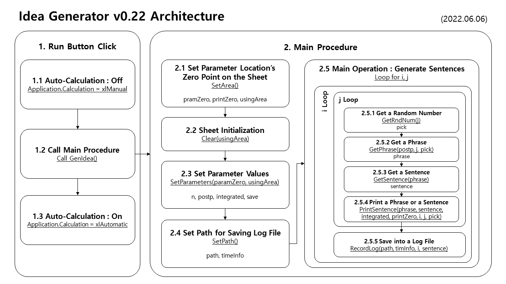

# [Idea Generator]

for my sister who is an aspiring writer


### To-Do

| Subject | Detail | Related Version | Completion Date |
|:-:|:--|:-:|:-:|
| Feature | Open **Idea Generator**(main) and **Dictionary** sheets with the `Run` button | [v0.10](#idea-generator-v010-20220518) | 2022.05.18 |
| | Select the number of sentences generated | [v0.10](#idea-generator-v010-20220518) | 2022.05.18 |
| | Add **postpositions** and make able to choose if use them or not | [v0.11](#idea-generator-v011-20220519) | 2022.05.19 |
| | Add **parameters validation** (not in code, but in **Excel** sheet) | [v0.11](#idea-generator-v011-20220519) | 2022.05.19 |
| | Print a line as an **integrated sentence** | [v0.12](#idea-generator-v012-20220520) | 2022.05.20 |
| | Save sentences into a **log file** | [v0.20](#idea-generator-v020-20220603) | 2022.06.03 |
| | - Bug Fix : Save properly whatever the parameters are | [v0.21](#idea-generator-v021-20220605) | 2022.06.05 |
| | Use **plural dictionaries** | (Coming) | (Coming) |
| | **Generate a paragraph** with `KoGPT2` `HyperCLOVA` and so on | (Coming) | (Coming) |
| Design | Add **title** and rearrange the parameters' locations | [v0.20](#idea-generator-v020-20220603) | 2022.06.03 |
| | …… More design improvement …… | (Coming) | (Coming) |
| Refactoring | **Partition** `GenIdea()` Procedure | [v0.22](#idea-generator-v022-20220606) | 2022.06.06 |
| | …… More architecture improvement …… | (Coming) | (Coming) |


### List

- [Idea Generator v0.22 (2022.06.06)](#idea-generator-v022-20220606)
- [Idea Generator v0.21 (2022.06.05)](#idea-generator-v021-20220605)
- [Idea Generator v0.20 (2022.06.03)](#idea-generator-v020-20220603)
- [Idea Generator v0.12 (2022.05.20)](#idea-generator-v012-20220520)
- [Idea Generator v0.11 (2022.05.19)](#idea-generator-v011-20220519)
- [Idea Generator v0.10 (2022.05.18)](#idea-generator-v010-20220518)


## [Idea Generator v0.22 (2022.06.06)](#list)

- **Refactoring** : Partition `GenIdea()` Procedure  
&nbsp;&nbsp;- Change only codes except the external feature



#### `IdeaGenerator_v0.22.bas`
```vba
Option Explicit
```
```vba
' Set Area : Zero Point and Using Area's Range / ★ Modify When the Sheet Design is Changed
Private Sub SetArea( _
    ByRef paramZero As Range, _
    ByRef printZero As Range, _
    ByRef usingArea As Range _
    )

    Set paramZero = Range("A3")
    Set printZero = Range("A5")
    Set usingArea = Range(printZero, printZero.Offset(10000, 5))

End Sub
```
```vba
' Clear Using Area
Private Sub Clear(ByRef usingArea As Range)

    usingArea.ClearContents

End Sub
```
```vba
' Set Parameters
Private Sub SetParameters( _
    ByRef paramZero As Range, _
    ByRef n As Integer, _
    ByRef postp As Integer, _
    ByRef integrated As Integer, _
    ByRef save As Integer, _
    ByRef usingArea As Range _
    )

    n = paramZero.Value
    postp = paramZero.Offset(0, 1).Value
    integrated = paramZero.Offset(0, 2).Value
    save = paramZero.Offset(0, 3).Value

    If integrated = 1 Then
        paramZero.Offset(0, 1).Value = 1                                        ' an integrated sentence should contain postpositions
        postp = paramZero.Offset(0, 1).Value
        usingArea.HorizontalAlignment = xlLeft                                  ' left alignment when the sentence is integrated
    Else
        usingArea.HorizontalAlignment = xlCenter                                ' center alignment when the sentence is not integrated
    End If

End Sub
```
```vba
' Set Log File Path
Private Sub SetPath( _
    ByRef path As String, _
    ByRef timeInfo As String _
    )

    Dim timeInfo1 As Date, _
        timeInfo2 As Date

    timeInfo1 = Date
    timeInfo2 = Time
    timeInfo = timeInfo1 & " " & timeInfo2

    path = ThisWorkbook.path & Application.PathSeparator & _
           "GenIdeaLog_" & timeInfo1 & ".txt"

End Sub
```
```vba
' Get Random Number to Pick a Word
Private Sub GetRndNum( _
    ByRef j As Integer, _
    ByRef pick As Integer _
    )

    Randomize
    pick = Int(Rnd * Sheet1.Cells(1, j)) + 1                                    ' want to find the way better than 'Sheet1' ……

End Sub
```
```vba
' Get a Phrase
Private Sub GetPhrase( _
    ByRef phrase As String, _
    ByRef postp As Integer, _
    ByRef j As Integer, _
    ByRef pick As Integer _
    )

    If postp = 1 Then
        ' Judge if Insert a Space or not
        If j = 5 Then
            phrase = Sheet1.Cells(pick + 2, j) & " " & Sheet1.Cells(2, j + 7)   ' Sheet1 / 2, 7 : depends on the dictionary sheet's structure
        Else
            phrase = Sheet1.Cells(pick + 2, j) & Sheet1.Cells(2, j + 7)         ' Sheet1
        End If
    Else
        phrase = Sheet1.Cells(pick + 2, j)                                      ' Sheet1
    End If

End Sub
```
```vba
' Get a Sentence
Private Sub GetSentence( _
    ByRef phrase As String, _
    ByRef sentence As String _
    )

    sentence = sentence & phrase & " "

End Sub
```
```vba
' Print each Phrase or integrated Sentence
Private Sub PrintSentence( _
    ByRef phrase As String, _
    ByRef sentence As String, _
    ByRef integrated As Integer, _
    ByRef printZero As Range, _
    ByRef i As Integer, _
    ByRef j As Integer, _
    ByRef pick As Integer _
    )

    If integrated = 0 Then                                                          ' if not integrate, print phrase on each cell
        printZero.Offset(i - 1, j - 1).Value = phrase

        ' test
        ' printZero.Offset(i - 1, j - 1).Value = Str(pick + 2) & " " & Str(j + 7)   ' 2, 7 : depends on the dictionary sheet's structure
    Else                                                                            ' if intergrate, print the completed sentence only when j = 6
        If j = 6 And integrated = 1 Then
            printZero.Offset(i - 1, 0).Value = sentence
        End If
    End If

End Sub
```
```vba
' Save a Sentences into a Log File
Private Sub RecordLog( _
    ByRef path As String, _
    ByRef timeInfo As String, _
    ByRef i As Integer, _
    ByRef sentence As String _
    )

    Dim fn          As Integer
    fn = FreeFile

    Dim logSentence As String
    logSentence = i & " " & sentence

    Open path For Append As #fn
        If i = 1 Then                                                           ' add timeInfo when i = 1
            Print #fn, timeInfo
        End If

        Print #fn, logSentence
    Close #fn

End Sub
```
```vba
' Main Procedure
Private Sub GenIdea()

    ' Set Area : Zero Point and Using Area's Range
    Dim paramZero   As Range, _
        printZero   As Range, _
        usingArea   As Range
    Call SetArea(paramZero, printZero, usingArea)

    ' Clear Using Area
    Call Clear(usingArea)

    ' Set Parameters
    Dim n           As Integer, _
        postp       As Integer, _
        integrated  As Integer, _
        save        As Integer
    Call SetParameters(paramZero, n, postp, integrated, save, usingArea)

    ' Set Log File Path
    If save = 1 Then                                                            ' if not save, path isn't needed
        Dim path    As String, _
            timeInfo As String
        Call SetPath(path, timeInfo)
    End If

    ' Loop for i, j
    Dim i           As Integer, _
        j           As Integer, _
        pick        As Integer                                                  ' i is recognized as Variant/Double when Dim i, j As Integer
    Dim sentence    As String, _
        phrase      As String

    For i = 1 To n

        sentence = ""                                                           ' initialize the sentence for each row

        For j = 1 To 6                                                          ' 6 from the dictionary that consists of 5W1H (dependent)

            phrase = ""                                                         ' initialize the phrase for each column

            ' Get Random Number to Pick a Word
            Call GetRndNum(j, pick)

            ' Get a Phrase
            Call GetPhrase(phrase, postp, j, pick)

            ' Get a Sentence
            Call GetSentence(phrase, sentence)                                  ' assemble sentence whenever integrate or not

            ' Print each Phrase or integrated Sentence
            Call PrintSentence(phrase, sentence, integrated, printZero, i, j, pick)

        Next j

        ' Save a Sentences into a Log File
        If save = 1 Then
            Call RecordLog(path, timeInfo, i, sentence)
        End If

    Next i

End Sub
```
```vba
' Run button to call GenIdea()
Private Sub btnRun_Click()

    Application.Calculation = xlManual
        Call GenIdea
    Application.Calculation = xlAutomatic

End Sub
```


## [Idea Generator v0.21 (2022.06.05)](#list)

- **Bug Fix** : Save properly whatever the parameters are


#### `GenIdeaLog_2022-06-05.txt` - Before (EUC-KR)
```txt
2022-06-05 오후 9:56:30
1 
2 
……
10 
```

#### `GenIdeaLog_2022-06-05.txt` - After (EUC-KR)
```txt
2022-06-05 오후 11:30:44
1 오크 이번주 던전 길드마스터 복수 기습 
2 엘프 이번주 도구점 국왕 레벨업 휴식 
……
10 엘프 이번주 바다 몬스터 아이템 획득 포획 
```

#### Mainly changed parts of `IdeaGenerator_v0.21.bas`
```vba
Private Sub GenIdea()

    ……

    ' Loop for i, j
    ……
    Dim sentence As String, phrase As String

    For i = 1 To n

        sentence = ""                                                       ' initialize the sentence for each row

        For j = 1 To 6

            phrase = ""                                                     ' initialize the phrase for each column

            ……

            ' Get a phrase
            If postp = 1 Then
                ' Judge if insert spaces or not
                If j = 5 Then
                    phrase = Sheet1.Cells(pick + 2, j) & " " & Sheet1.Cells(2, j + 7)
                Else
                    phrase = Sheet1.Cells(pick + 2, j) & Sheet1.Cells(2, j + 7)
                End If
            Else
                phrase = Sheet1.Cells(pick + 2, j)
            End If

            ' Assemble sentence whenever integrate or not
            sentence = sentence & phrase & " "

            ' Print each phrase or integrated sentence
            ' If not integrate, print phrase on each cell
            If integrated = 0 Then
                Cells(i + 4, j).Value = phrase

                ' test
                ' Cells(i + 4, j).Value = Str(pick + 2) & " " & Str(j + 7)
            ' If intergrate, print the completed sentence only when j = 6
            Else
                If j = 6 And integrated = 1 Then
                    Cells(i + 4, 1).Value = sentence
                End If
            End If

        Next j

        ……

    Next i

End Sub
```


## [Idea Generator v0.20 (2022.06.03)](#list)

- Add Feature : Can save sentences into a **log file** and choose if do it or not
- Improve Design(?) : add **title** and rearrange the parameters' locations
- Further Discussion about Technical Issues raised here:  
&nbsp;&nbsp;- [`ByRef` vs `ByVal` (2022.06.05)](https://github.com/kimpro82/MyPractice/tree/master/VBA#byref-vs-byval-20220605)  
&nbsp;&nbsp;- [Declare Plural Variable (2022.06.04)](https://github.com/kimpro82/MyPractice/tree/master/VBA#declare-plural-variable-20220604)


#### `GenIdeaLog_2022-06-04.txt` (EUC-KR)
```txt
2022-06-04 오후 11:39:05
1 오크이/가 이번주 도구점에서 병사을/를 아이템 획득 때문에/위하여 마법공격하다 
2 드루이드이/가 지난주 대장간에서 몬스터을/를 토벌 때문에/위하여 치료하다 
……
10 도적이/가 이번주 여관에서 병사을/를 의뢰 때문에/위하여 포획하다 
```

#### Mainly changed parts of `IdeaGenerator_v0.20.bas`
```vba
Private Sub GenIdea()

    ……

    ' Parameters
    Dim n As Integer, postp As Integer, integrated As Integer, pick As Integer, save As Integer

    ……
    save = Range("D3")

    ……

    ' Loop for i, j
    Dim i As Integer, j As Integer                                          ' i is recognized as Variant/Double when Dim i, j As Integer
    Dim sentence As String

    For i = 1 To n

        ……

        ' Call RecordLog() for Saving into a separated log file
        If save = 1 Then
            Call RecordLog(i, sentence)
        End If

    Next i

End Sub
```
```vba
' Save sentences into a log file
Private Sub RecordLog(ByRef i As Integer, ByRef sentence As String)

    ' Set log file name
    Dim path As String, timeInfo As String, logSentence As String
    Dim timeInfo1 As Date, timeInfo2 As Date
    timeInfo1 = Date
    timeInfo2 = Time
    timeInfo = timeInfo1 & " " & timeInfo2
    path = ThisWorkbook.path & Application.PathSeparator & "GenIdeaLog_" & timeInfo1 & ".txt"

    Dim fn As Integer
    fn = FreeFile

    ' Record the sentences
    logSentence = i & " " & sentence
    Open path For Append As #fn
        If i = 1 Then                                                       ' when the log file should be initialized
            Print #fn, timeInfo
        End If
        
        Print #fn, logSentence
    Close #fn

End Sub
```


## [Idea Generator v0.12 (2022.05.20)](#list)

- Can print a line as an **integrated sentence** (suggested from my friend *2071*)  
&nbsp;&nbsp;- Can choose if integrate or not  
&nbsp;&nbsp;- Contain postpositions automatically when choose to integrate  
&nbsp;&nbsp;- Change alignment automatically (left / center)  
&nbsp;&nbsp;- Add spaces more naturally when choose to integrate


#### Mainly changed parts of `IdeaGenerator_v0.12.bas`
```vba
Option Explicit
```
```vba
    ……
    ' Parameters
    Dim n, postp, integrated, pick As Integer
    ……
    integrated = Range("D2")

    If integrated = 1 Then
        Range("B2").Value = 1                                               ' an integrated sentence should contain postpositions
        postp = Range("B2")
        Range("A4:F10000").HorizontalAlignment = xlLeft                     ' left alignment when the sentence is integrated
    Else
        Range("A4:F10000").HorizontalAlignment = xlCenter                   ' center alignment when the sentence is not integrated
    End If
    ……
```
```vba
    ……
    ' Loop for i, j
    Dim i, j As Integer
    Dim sentence As String

    For i = 1 To n

        sentence = ""                                                       ' initialize the sentence for each row

        For j = 1 To 6

            ' Get a word randomly
            ……

            ' Integrated sentences
            If integrated = 1 Then

                ' Judge where insert spaces
                If j = 5 Then
                    sentence = sentence & Sheet1.Cells(pick + 2, j) & " " & Sheet1.Cells(2, j + 7) & " "
                Else
                    sentence = sentence & Sheet1.Cells(pick + 2, j) & Sheet1.Cells(2, j + 7) & " "
                End If

                ' Print the completed sentence
                If j = 6 Then
                    Cells(i + 3, 1).Value = sentence
                End If

            ' Not integrated but contain postpositions
            ElseIf postp = 1 Then

                ……

            ' Neither integrated nor contain postpositions
            Else

                ……

            End If

        Next j

    Next i
```


## [Idea Generator v0.11 (2022.05.19)](#list)

- Add **postpositions** and make able to **choose** if use them or not
- Add **parameters validation** (not in code, but in **Excel** sheet)

  


#### Mainly changed parts of `IdeaGenerator_v0.11.bas`
```vba
'Option Explicit                                                            ' Cause an error : i, j are not declared strictly
```
```vba
    ……
    Dim n, postp, pick As Integer
    ……
    postp = Range("B2")
    ……
```
```vba
            ……
            If postp = 1 Then
'               Cells(i + 3, j).Value = Str(pick + 2) & " " & Str(j + 7)    ' test
                Cells(i + 3, j).Value = Sheet1.Cells(pick + 2, j) & " " & Sheet1.Cells(2, j + 7)
            Else
                Cells(i + 3, j).Value = Sheet1.Cells(pick + 2, j)
            End If
            ……
```


## [Idea Generator v0.10 (2022.05.18)](#list)

- Initialize : open **Idea Generator**(main) and **Dictionary** sheets with the `Run` button
- Can select the number of sentences generated
- Test : Ok

  


```vba
Sub GenIdea()

    Range("A4:F10000").ClearContents

    Dim n, pick As Integer
    n = Range("B1")

    For i = 1 To n
        For j = 1 To 6
            Randomize
            pick = Int(Rnd * Sheet1.Cells(1, j)) + 1

'            Cells(i + 3, j).Value = Str(pick + 1) & " " & Str(j)   ' test
            Cells(i + 3, j).Value = Sheet1.Cells(pick + 2, j)
        Next j
    Next i

End Sub
```
```vba
Private Sub btnRun_Click()

    Application.Calculation = xlManual
        Call GenIdea
    Application.Calculation = xlAutomatic

End Sub
```