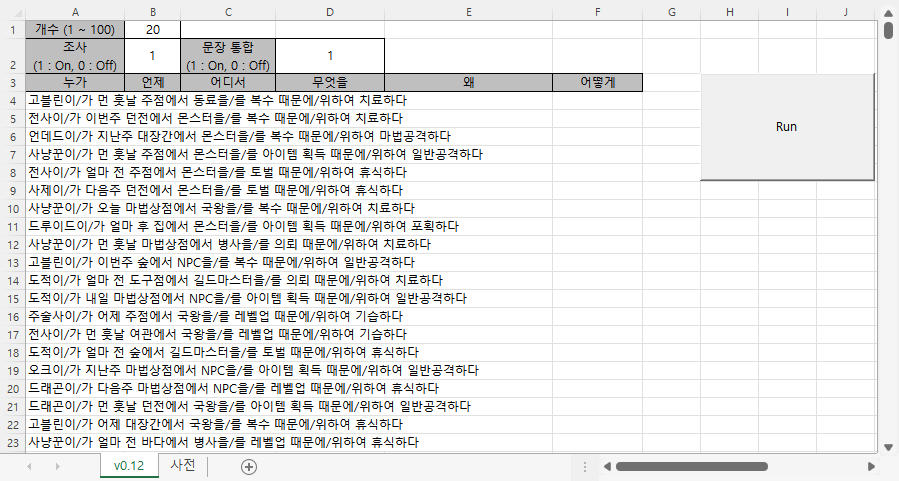
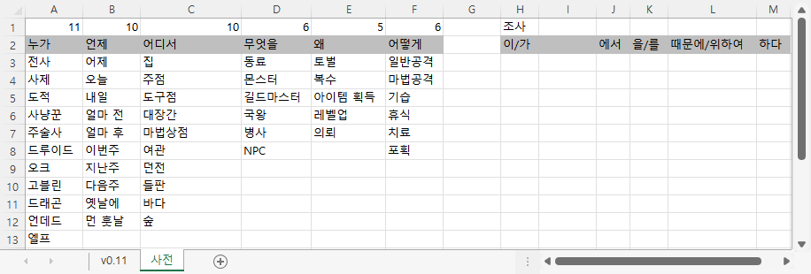

# [Idea Generator]

for my sister who is an aspiring writer


### List

- [Idea Generator v0.12 (2022.05.20)](#idea-generator-v012-20220520)
- [Idea Generator v0.11 (2022.05.19)](#idea-generator-v011-20220519)
- [Idea Generator v0.1 (2022.05.18)](#idea-generator-v01-20220518)


## [Idea Generator v0.12 (2022.05.20)](#list)

- Can print a line as an **integrated sentence** (suggested from my friend *2071*)
&nbsp;&nbsp;- Can choose if intergrate or not
&nbsp;&nbsp;- Contain postpositions automatically when choose to integrate
&nbsp;&nbsp;- Change alignment automatically (left / center) 
&nbsp;&nbsp;- Add spaces more naturally when choose to intergrate



#### Mainly changed parts of `IdeaGenerator_v0.12.bas`
```vba
Option Explicit
```
```vba
    ……
    ' Parameters
    Dim n, postp, integrated, pick As Integer
    ……
    integrated = Range("D2")

    If integrated = 1 Then
        Range("B2").Value = 1                                               ' an integrated sentence should contain postpositions
        postp = Range("B2")
        Range("A4:F10000").HorizontalAlignment = xlLeft                     ' left alignment when the sentence is integrated
    Else
        Range("A4:F10000").HorizontalAlignment = xlCenter                   ' center alignment when the sentence is not integrated
    End If
    ……
```
```vba
    ……
    ' Loop for i, j
    Dim i, j As Integer
    Dim sentence As String

    For i = 1 To n

        sentence = ""                                                       ' initialize the sentence for each row

        For j = 1 To 6

            ' Get a word randomly
            ……

            ' Integrated sentences
            If integrated = 1 Then

                ' Judge where insert spaces
                If j = 5 Then
                    sentence = sentence & Sheet1.Cells(pick + 2, j) & " " & Sheet1.Cells(2, j + 7) & " "
                Else
                    sentence = sentence & Sheet1.Cells(pick + 2, j) & Sheet1.Cells(2, j + 7) & " "
                End If

                ' Print the completed sentence
                If j = 6 Then
                    Cells(i + 3, 1).Value = sentence
                End If

            ' Not integrated but contain postpositions
            ElseIf postp = 1 Then

                ……

            ' Neither integrated nor not contain postpositions
            Else

                ……

            End If

        Next j

    Next i
```


## [Idea Generator v0.11 (2022.05.19)](#list)

- Add **postpositions** and make able to **choose** if use them or not
- Add **parameters validation** (not in code, but in **Excel** sheet)
- To-Do :  
&nbsp;&nbsp;- Print a line as an integrated sentence (suggested from my friend *2071*)  
&nbsp;&nbsp;- Save as a seperated log file  
&nbsp;&nbsp;- Expand to generate a parapraph with `KoGPT2` `HyperCLOVA` and so on

  


#### Mainly changed parts of `IdeaGenerator_v0.11.bas`
```vba
'Option Explicit                                                            ' Cause an error : i, j are not declared strictly
```
```vba
    ……
    Dim n, postp, pick As Integer
    ……
    postp = Range("B2")
    ……
```
```vba
            ……
            If postp = 1 Then
'               Cells(i + 3, j).Value = Str(pick + 2) & " " & Str(j + 7)    ' test
                Cells(i + 3, j).Value = Sheet1.Cells(pick + 2, j) & " " & Sheet1.Cells(2, j + 7)
            Else
                Cells(i + 3, j).Value = Sheet1.Cells(pick + 2, j)
            End If
            ……
```


## [Idea Generator v0.1 (2022.05.18)](#list)

- Initialize : open **Idea Generator**(main) and **Dictionary** sheets with the `Run` button
- Can select the number of sentences generated
- Test : Ok

  


```vba
Sub GenIdea()

    Range("A4:F10000").ClearContents

    Dim n, pick As Integer
    n = Range("B1")

    For i = 1 To n
        For j = 1 To 6
            Randomize
            pick = Int(Rnd * Sheet1.Cells(1, j)) + 1

'            Cells(i + 3, j).Value = Str(pick + 1) & " " & Str(j)   ' test
            Cells(i + 3, j).Value = Sheet1.Cells(pick + 2, j)
        Next j
    Next i

End Sub
```
```vba
Private Sub btnRun_Click()

    Application.Calculation = xlManual
        Call GenIdea
    Application.Calculation = xlAutomatic

End Sub
```