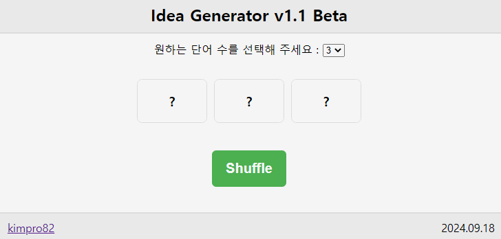
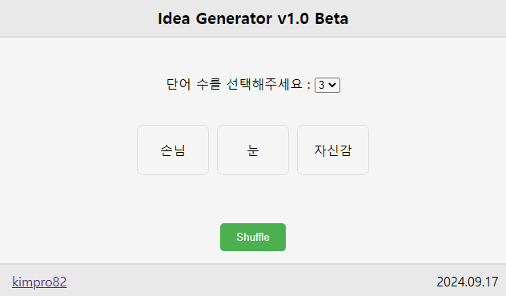

# [Idea Generator (Web)](/README.md#web)

A gift made for my aspiring writer sister as a reward for loyalty


### \<List>

- [Idea Generator v1.1 Beta (2024.09.18)](#idea-generator-v11-beta-20240918)
- [Idea Generator v1.0 Beta (2024.09.17)](#idea-generator-v10-beta-20240917)


## [Idea Generator v1.1 Beta (2024.09.18)](#list)

- Improvements from [Idea Generator v1.0 Beta (2024.09.17)](#idea-generator-v10-beta-20240917)
  - Enhancements to the word shuffle process, including visualization
    - Display "?" on word cards at the start
    - Visualize the word shuffle process
      - Added acceleration, attempted fade-in-fade-out effect but it failed
    - Prevented duplicate word selection
    - Replaced spaces in words with `<br>`
    - Used the same word list as version `1.0`
  - *CSS*: Applied relative values for size and positioning properties

  

- Future improvements
  - Word list enhancement: quantitative expansion, thematic categorization, etc
  - Change word count selection method: switch from *combobox* to a more mobile-friendly approach
- Code
  <details>
    <summary>idea_generator_1_1_beta.html (mainly changed parts)</summary>

  ```html
  ……
  <body>
    ……

    <!-- ComboBox for selecting the number of words to generate -->
    <div class="select-container">
      <label for="wordCount">원하는 단어 수를 선택해 주세요 : </label>
      ……
    </div>
    ……
  </body>
  ……
  ```
  </details>
  <details>
    <summary>idea_generator_1_1_beta.css (almost new)</summary>

  ```css
  body {
    display: flex;                        /* Center content using Flexbox */
    flex-direction: column;               /* Vertical layout for header, generator, footer */
    justify-content: center;              /* Vertically center content */
    align-items: center;                  /* Horizontally center content */
    height: 100vh;                        /* Full viewport height */
    margin: 0;                            /* Remove default margins */
    background-color: #f4f4f4;            /* Light background color */
  }

  header {
    /* Header styling and positioning */
    width: 100%;
    text-align: center;
    padding: 0.625em 0;
    background-color: #eaeaea;
    border-bottom: 0.125em solid #ddd;
    position: absolute;
    top: 0;
  }

  .header-center {
    font-size: 1.5em;
    font-weight: bold;
  }

  .select-container {
    /* Margin for combobox */
    margin-top: -2em;
    margin-bottom: 1em;
  }

  footer {
    /* Footer styling and positioning */
    width: 100%;
    display: flex;
    justify-content: space-between;
    padding: 0.625em 1.25em;
    background-color: #eaeaea;
    border-top: 0.125em solid #ddd;
    position: absolute;
    bottom: 0;
  }

  .footer-left, .footer-right {
    font-size: 1em;
  }
  ```
  ```css
  #generator {
    /* Grid layout for cards */
    display: grid;
    gap: 0.625em;
    text-align: center;
    margin-top: 1em;
  }

  /* Grid layout for different numbers of cards */
  #generator.grid-1 { grid-template-columns: repeat(1, 1fr); }
  #generator.grid-2 { grid-template-columns: repeat(2, 1fr); }
  #generator.grid-3 { grid-template-columns: repeat(3, 1fr); }
  #generator.grid-4 { grid-template-columns: repeat(2, 1fr); }
  #generator.grid-5 { grid-template-columns: 1fr 1fr 1fr; }
  #generator.grid-5 .card:nth-child(4),
  #generator.grid-5 .card:nth-child(5) {
    grid-column: span 1;
  }
  #generator.grid-6 { grid-template-columns: repeat(3, 1fr); }

  .card {
    /* Card styling */
    position: relative;
    padding: 1em;
    border: 0.0625em solid #ddd;
    background-color: #fff;
    border-radius: 0.5em;
    cursor: pointer;
    overflow: hidden;
    min-width: 4.25em;
    min-height: 1.875em;
    display: flex;
    align-items: center;
    justify-content: center;
  }

  .card .text-wrapper {
    /* Text wrapper positioning and styling */
    position: absolute;
    top: 50%;
    left: 50%;
    transform: translate(-50%, -50%);
    height: 100%;
    width: 100%;
    display: flex;
    justify-content: center;
    align-items: center;
    font-size: 1.2em;
    font-weight: bold;
    transition: opacity 0.5s ease;
    overflow: hidden;
  }

  #output {
    /* Output text styling */
    margin-top: 1.25em;
    font-weight: bold;
    text-align: center;
  }
  ```
  ```css
  #shuffleBtn {
    /* Shuffle button styling */
    margin-top: 1em;
    padding: 0.75em 1em;
    font-size: 1.25em;
    font-weight: bold;
    background-color: #4caf50;
    color: #fff;
    border: none;
    border-radius: 0.3125em;
    cursor: pointer;
    position: relative;
  }

  .button-container {
    /* Button container layout */
    display: flex;
    justify-content: center;
    width: 100%;
    margin-top: 1.25em;
  }
  ```
  </details>
  <details>
    <summary>idea_generator_1_1_beta.ts (mainly changed parts)</summary>

  ```ts
  // Constants for animation
  const MAX_SHUFFLE_COUNT: number = 20;  // Number of rapid word changes
  const SHUFFLE_INTERVAL: number = 20;  // Interval between word changes in milliseconds
  ```
  ```ts
  // This event listener triggers when the DOM content is fully loaded
  document.addEventListener('DOMContentLoaded', async () => {
    ……

    /**
     * Generates a random selection of unique words.
     * 
     * @param {number} count - The number of words to generate.
     * @returns {string[]} An array of randomly selected words.
     */
    function generateWords(count: number): string[] {
      if (count > words.length) {
        throw new Error("Requested word count exceeds available unique words.");
      }

      const selectedWords: string[] = [];
      const usedIndices: Set<number> = new Set();

      while (selectedWords.length < count) {
        const randomIndex = Math.floor(Math.random() * words.length);
        if (!usedIndices.has(randomIndex)) {
          usedIndices.add(randomIndex);
          // Replace space with <br>
          const word = words[randomIndex].replace(/ /g, "<br>");
          selectedWords.push(word);
        }
      }

      return selectedWords;
    }

    ……
  });
  ```
  ```ts
  // This event listener triggers when the DOM content is fully loaded
  document.addEventListener('DOMContentLoaded', async () => {
    ……

    /**
     * Displays the selected number of words in the 'generator' container.
     * Initially shows "?" and then animates the words when shuffled.
     * 
     * @param {number} count - The number of words to display.
     */
    function displayWords(count: number): void {
      generator.innerHTML = ''; // Clear any previously displayed words
      generator.className = `grid-${count}`; // Set the grid class for layout

      const selectedWords = Array(count).fill("?"); // Initially show "?" on each card

      selectedWords.forEach((word) => {
        const card = document.createElement('div'); // Create a new card element for each word
        card.className = 'card'; // Apply the 'card' class for styling

        // Create a wrapper for the text
        const textWrapper = document.createElement('div');
        textWrapper.className = 'text-wrapper';
        textWrapper.innerHTML = word; // Set the "?" as the initial content of the wrapper

        card.appendChild(textWrapper); // Append the wrapper to the card
        generator.appendChild(card); // Append the card to the generator container
      });
    }

    ……
  });
  ```
  ```ts
  // This event listener triggers when the DOM content is fully loaded
  document.addEventListener('DOMContentLoaded', async () => {
    ……

    /**
     * Animates the shuffling of words on the cards.
     * 
     * @param {number} count - The number of words to shuffle and display.
     */
    function animateShuffle(count: number): void {
      const cards = Array.from(generator.getElementsByClassName('card')) as HTMLElement[];
      const selectedWords = generateWords(count);
      let shuffleCount = 0;

      function updateWords() {
        cards.forEach(card => {
          const textWrapper = card.querySelector('.text-wrapper') as HTMLElement;
          const randomIndex = Math.floor(Math.random() * words.length);
          textWrapper.innerHTML = words[randomIndex].replace(/ /g, "<br>"); // Replace space with <br>
        });

        shuffleCount++;
        if (shuffleCount < MAX_SHUFFLE_COUNT) {
          setTimeout(updateWords, SHUFFLE_INTERVAL); // Change words quickly
        } else {
          // Set final words after shuffling
          cards.forEach((card, index) => {
            const textWrapper = card.querySelector('.text-wrapper') as HTMLElement;
            textWrapper.innerHTML = selectedWords[index]; // Final words
          });
        }
      }

      // Start the shuffling
      updateWords();
    }

    ……
  });
  ```
  ```ts
  // This event listener triggers when the DOM content is fully loaded
  document.addEventListener('DOMContentLoaded', async () => {
    ……

    // Event listener to update the word count and re-display words when the dropdown selection changes
    wordCountSelect.addEventListener('change', (event) => {
      const selectedCount = parseInt((event.target as HTMLSelectElement).value, 10);
      displayWords(selectedCount); // Redisplay with "?" initially
    });

    // Event listener to shuffle and regenerate the words when the 'Shuffle' button is clicked
    shuffleBtn.addEventListener('click', () => {
      const selectedCount = parseInt(wordCountSelect.value, 10);
      animateShuffle(selectedCount); // Animate shuffling of words
    });

    ……
  });
  ```
  </details>


## [Idea Generator v1.0 Beta (2024.09.17)](#list)

- Overview
  - Migration from [Idea Generator (VBA)](/IdeaGenerator/VBA/README.md) to a web-based version using *TypeScript* and vanilla *CSS*
  - After specifying a number `n` between 1 and 6 via a combobox, pressing the *shuffle* button displays `n` idea cards
  - The word dictionary consists of 200 words focusing on everyday terms and emotions, generated with *ChatGPT*

  

- Future Improvements
  - Word dictionary enhancement: expanding the quantity and categorizing words by themes

- Code
  <details>
    <summary>idea_generator_1_0_beta.html</summary>

  ```html
  <!DOCTYPE html>

  ……

  <html lang="en">
  <head>
    <meta charset="UTF-8">
    <meta name="viewport" content="width=device-width, initial-scale=1.0"> <!-- Responsive design for mobile devices -->
    <title>Idea Generator</title>
    <link rel="stylesheet" href="idea_generator_1_0_beta.css">
    <script defer src="idea_generator_1_0_beta.js"></script>
  </head>
  <body>
    ……

    <footer>
      ……
    </footer>
  </body>
  </html>
  ```
  ```html
  <body>
    <header>
      <div class="header-center">Idea Generator v1.0 Beta</div>
    </header>

    <!-- ComboBox for selecting the number of words to generate -->
    <div class="select-container">
      <label for="wordCount">Select the number of words: </label>
      <select id="wordCount">
        <option value="1">1</option>
        <option value="2">2</option>
        <option value="3" selected>3</option>       <!-- Default value set to 3 -->
        <option value="4">4</option>
        <option value="5">5</option>
        <option value="6">6</option>
      </select>
    </div>

    <!-- Container for displaying generated idea cards -->
    <div id="generator"></div>

    <!-- Button to shuffle and generate new idea cards -->
    <div class="button-container">
      <button id="shuffleBtn">Shuffle</button>
    </div>

    <footer>
      ……
    </footer>
  </body>
  ```
  ```html
  <body>
    ……

    <footer>
      <!-- Link to GitHub profile, opens in new tab -->
      <div class="footer-left">
        &nbsp;&nbsp;
        <a href="https://github.com/kimpro82/MyFamilyCare" target="_blank">
          kimpro82
        </a>
      </div>

      <!-- Display the current date -->
      <div class="footer-right">2024.09.17&nbsp;&nbsp;</div>
    </footer>
  </body>
  ```
  </details>
  <details>
    <summary>idea_generator_1_0_beta.ts</summary>

  ```ts
  // The name of the external JSON file containing words data
  const dataFileName: string = 'data_1_0_beta.json';

  // Interface to define the structure of the word data from the JSON file
  interface WordData {
    words: string[];
  }
  ```
  ```ts
  /**
   * Fetches word data from the external JSON file.
   * 
   * @returns {Promise<WordData>} A promise that resolves with the word data.
   * @throws Will throw an error if the fetch request fails.
   */
  async function fetchWords(): Promise<WordData> {
    const response = await fetch(dataFileName);
    if (!response.ok) {
      throw new Error(`Failed to fetch words: ${response.statusText}`);
    }
    return response.json();
  }
  ```
  ```ts
  // This event listener triggers when the DOM content is fully loaded
  document.addEventListener('DOMContentLoaded', async () => {
    const generator = document.getElementById('generator') as HTMLElement; // Container for displaying words
    const wordCountSelect = document.getElementById('wordCount') as HTMLSelectElement; // Dropdown for selecting word count
    const shuffleBtn = document.getElementById('shuffleBtn') as HTMLButtonElement; // Shuffle button

    let words: string[] = []; // Array to store the fetched words

    try {
      // Fetch the words from the external JSON file
      const wordData = await fetchWords();
      words = wordData.words;
    } catch (error) {
      console.error('Error fetching words:', error); // Log if there is an error while fetching words
    }

    /**
     * Generates a random selection of words.
     * 
     * @param {number} count - The number of words to generate.
     * @returns {string[]} An array of randomly selected words.
     */
    function generateWords(count: number): string[] {
      const selectedWords: string[] = [];
      for (let i = 0; i < count; i++) {
        const randomIndex = Math.floor(Math.random() * words.length);
        selectedWords.push(words[randomIndex]); // Randomly select words from the 'words' array
      }
      return selectedWords;
    }

    /**
     * Displays the selected number of words in the 'generator' container.
     * Adjusts the grid layout based on the number of words.
     * 
     * @param {number} count - The number of words to display.
     */
    function displayWords(count: number): void {
      generator.innerHTML = ''; // Clear any previously displayed words
      generator.className = `grid-${count}`; // Set the grid class for layout

      const selectedWords = generateWords(count); // Get the randomly selected words

      selectedWords.forEach((word) => {
        const card = document.createElement('div'); // Create a new card element for each word
        card.className = 'card'; // Apply the 'card' class for styling
        card.textContent = word; // Set the word as the content of the card
        generator.appendChild(card); // Append the card to the generator container
      });
    }

    // Initial display with a default selection of 3 words
    displayWords(3);

    // Event listener to update the word count and re-display words when the dropdown selection changes
    wordCountSelect.addEventListener('change', (event) => {
      const selectedCount = parseInt((event.target as HTMLSelectElement).value, 10);
      displayWords(selectedCount);
    });

    // Event listener to shuffle and regenerate the words when the 'Shuffle' button is clicked
    shuffleBtn.addEventListener('click', () => {
      const selectedCount = parseInt(wordCountSelect.value, 10);
      displayWords(selectedCount); // Redisplay with the currently selected number of words
    });
  });
  ```
  </details>
  <details>
    <summary>idea_generator_1_0_beta.css</summary>

  ```css
  body {
    display: flex;                        /* Flexbox layout to center content */
    flex-direction: column;               /* Column layout for header, generator, footer */
    justify-content: center;              /* Vertically center content */
    align-items: center;                  /* Horizontally center content */
    height: 100vh;                        /* Full viewport height */
    margin: 0;                            /* Remove default margins */
    background-color: #f4f4f4;            /* Light background color */
  }

  header {
    width: 100%;                          /* Full-width header */
    text-align: center;                   /* Center the text */
    padding: 10px 0;                      /* Padding above and below the text */
    background-color: #eaeaea;            /* Light gray background */
    border-bottom: 2px solid #ddd;        /* Bottom border for header */
    position: absolute;                   /* Positioned at the top of the page */
    top: 0;                               /* Stick to the top */
  }

  .header-center {
    font-size: 20px;                      /* Header font size */
    font-weight: bold;                    /* Bold font style */
  }

  .select-container {
    margin: 20px 0;                       /* Vertical margin for the combobox */
  }

  footer {
    width: 100%;                          /* Full-width footer */
    display: flex;                        /* Flexbox layout for spacing content */
    justify-content: space-between;                                 /* Space between left and right footer items */
    padding: 10px 20px;                   /* Padding inside the footer */
    background-color: #eaeaea;            /* Light gray background */
    border-top: 2px solid #ddd;           /* Top border for footer */
    position: absolute;                   /* Positioned at the bottom of the page */
    bottom: 0;                            /* Stick to the bottom */
  }

  .footer-left {
    text-align: left;                     /* Left-align the text */
    font-size: 16px;                      /* Font size */
  }

  .footer-right {
    text-align: right;                    /* Right-align the text */
    font-size: 16px;                      /* Font size */
  }
  ```
  ```css
  #generator {
    display: grid;                            /* CSS Grid layout for cards */
    gap: 10px;                                /* Space between grid items */
    text-align: center;                       /* Center text inside grid items */
    margin-top: 20px;                         /* Margin at the top of the generator */
  }

  /* Grid layout for 1 card */
  #generator.grid-1 {
    grid-template-columns: repeat(1, 1fr);    /* 1 column grid */
  }

  /* Grid layout for 2 cards */
  #generator.grid-2 {
    grid-template-columns: repeat(2, 1fr);    /* 2 column grid */
  }

  /* Grid layout for 3 cards */
  #generator.grid-3 {
    grid-template-columns: repeat(3, 1fr);    /* 3 column grid */
  }

  /* Grid layout for 4 cards (2 columns) */
  #generator.grid-4 {
    grid-template-columns: repeat(2, 1fr);    /* 2 column grid for 4 cards */
  }

  /* Grid layout for 5 cards with specific layout */
  #generator.grid-5 {
    grid-template-columns: 1fr 1fr 1fr;       /* First row has 3 columns */
  }

  /* Center-align the 4th and 5th cards for grid-5 layout */
  #generator.grid-5 .card:nth-child(4),
  #generator.grid-5 .card:nth-child(5) {
    grid-column: span 1;                      /* Each card occupies 1 column */
    justify-self: center;                     /* Align these cards to the center */
  }

  /* Grid layout for 6 cards */
  #generator.grid-6 {
    grid-template-columns: repeat(3, 1fr);    /* 3 column grid for 6 cards */
  }
  ```
  ```css
  .card {
    padding: 20px;                        /* Padding inside the card */
    border: 1px solid #ddd;               /* Light border around the card */
    background-color: #fff;               /* White background for the card */
    border-radius: 8px;                   /* Rounded corners */
    cursor: pointer;                      /* Pointer cursor on hover */
  }

  #output {
    margin-top: 20px;                     /* Margin above the output text */
    font-weight: bold;                    /* Bold output text */
    text-align: center;                   /* Center the output text */
  }

  #shuffleBtn {
    margin-top: 20px;                     /* Margin above the button */
    padding: 10px 20px;                   /* Padding inside the button */
    background-color: #4caf50;            /* Green background for the button */
    color: #fff;                          /* White text color */
    border: none;                         /* Remove the border */
    border-radius: 5px;                   /* Rounded corners for the button */
    cursor: pointer;                      /* Pointer cursor on hover */
    position: relative;                   /* Relative positioning for potential future use */
  }

  .button-container {
    display: flex;                        /* Flexbox layout to center the button */
    justify-content: center;              /* Horizontally center the button */
    width: 100%;                          /* Full-width container */
    margin-top: 20px;                     /* Margin above the button container */
  }
  ```
  </details>
  <details>
    <summary>data_1_0_beta.json</summary>

  ```json
  {
    "words": [
      "기쁨", "슬픔", "사랑", "행복", "분노",
      "우정", "감사", "외로움", "두려움", "안심",
      "놀라움", "설렘", "편안함", "짜증", "질투",
      "희망", "절망", "뿌듯함", "서운함", "죄책감",
      "용기", "자부심", "부끄러움", "만족", "피로",
      "피곤", "불안", "실망", "자신감", "후회",
      "의지", "동경", "따뜻함", "차가움", "고독",
      "행운", "무기력", "자유", "속상함", "이해",
      "오해", "칭찬", "비난", "성공", "실패",
      "몰입", "열정", "불편", "아쉬움", "기대",
      "환희", "충격", "기대감", "좌절", "배신감",
      "안도", "친밀감", "낙관", "비관", "사랑스러움",
      "동의", "반대", "고마움", "감동", "희열",
      "무서움", "아름다움", "평화", "혼란", "경이로움",
      "익숙함", "낯섦", "분주함", "여유", "바쁨",
      "건강", "피곤함", "활기", "적막", "소란",
      "차분함", "열기", "고요함", "자연", "바람",
      "햇살", "구름", "비", "눈", "바다",
      "산", "하늘", "나무", "꽃", "숲",
      "강", "들판", "길", "집", "방",
      "창문", "문", "책상", "의자", "침대",
      "의류", "옷", "신발", "가방", "전화",
      "컴퓨터", "책", "음악", "영화", "사진",
      "시계", "안경", "커피", "차", "물",
      "식사", "음식", "과일", "채소", "고기",
      "빵", "밥", "국", "간식", "초콜릿",
      "케이크", "우유", "달", "별", "우산",
      "자동차", "버스", "지하철", "자전거", "비행기",
      "여행", "지도", "공원", "도시", "마을",
      "학교", "회사", "병원", "약국", "서점",
      "식당", "카페", "시장", "상점", "호텔",
      "공항", "역", "정류장", "거리", "광장",
      "사람", "아이", "어른", "친구", "가족",
      "부모", "형제", "자매", "동료", "선생님",
      "학생", "고객", "손님", "주인", "이웃",
      "사랑하는 사람", "동물", "강아지", "고양이", "새",
      "물고기", "꽃", "식물", "나무", "풀",
      "열매", "씨앗", "뿌리", "가지", "잎",
      "손", "발", "얼굴", "눈", "입",
      "귀", "코", "머리", "가슴", "배",
      "허리", "다리", "팔", "뼈", "근육",
      "심장", "뇌", "피", "숨", "잠"
    ]
  }
  ```
  </details>
