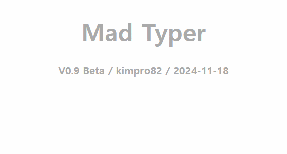

# [Mad Typer](/README.md#mad-typer)

But you must not break the keyboard **again**, son


### \<List>

- [Mad Typer v0.9 Beta (2024.11.18)](#mad-typer-v09-beta-20241118)


## [Mad Typer v0.9 Beta (2024.11.18)](#list)

- Overview: A typing game designed to stimulate a child's visual-tactile coordination
  - Displays the entered characters as text on the screen with random positions, sizes, colors and fonts
  - Outputs all alphabetic inputs in uppercase letters
  - Attempts to block browser shortcut keys, including Function keys, but cannot control special keys managed by the operating system, such as the Windows key

  

- Future improvements
  - Add support for Korean input: Currently unavailable due to IME deactivation  
  - Integrate with the Web Speech API to provide text-to-speech functionality 

- Code
  <details>
    <summary>MadTyper_0.9.html</summary>

  ```html
  <!DOCTYPE html>

  <html lang="ko">

  <head>
      ……
      <link rel="stylesheet" href="MadTyper_0.9.css">
      <script defer src="MadTyper_0.9.js"></script>
  </head>

  <body>
      <h1>Mad Typer</h1>
      <h2>v0.9 Beta / kimpro82 / 2024-11-18</h2>
  </body>

  </html>
  ```
  </details>
  <details>
    <summary>MadTyper_0.9.css</summary>

  ```css
  body {
      margin: 0;
      padding: 0;
      overflow: hidden;
      background-color: #fff;
  }

  h1, h2 {
      top: 10px;
      text-align: center;
      font-family: sans-serif;
      font-weight: bold;
      color: #aaa;
  }
  h1 {
      font-size: 3em;
  }
  h2 {
      font-size: 1.25em;
  }
  ```
  ```css
  .typed-char {
      position: absolute;
      opacity: 0;
      transition: opacity 1s ease-in-out;
      font-weight: bold;
  }
  ```
  </details>
  <details>
    <summary>MadTyper_0.9.ts</summary>

  ```ts
  /**
  * TypingVisualizer class
  * Creates a visual effect for typed characters on the webpage.
  */
  class TypingVisualizer {
      // Constants for customization
      private static readonly IS_TEST: boolean = false; // Set to true to enable test mode
      private static readonly FONTS: string[] = [
      'Arial', 'Verdana', 'Times New Roman', 'Courier New', 'Georgia',
      'Helvetica', 'Palatino', 'Garamond', 'Bookman', 'Comic Sans MS'
  ];
      private static readonly MIN_FONT_SIZE: number = 50;
      private static readonly MAX_FONT_SIZE: number = 150;
      private static readonly CHAR_OPACITY: number = 0.7;
      private static readonly FADE_IN_DELAY: number = 10;
      private static readonly DISPLAY_DURATION: number = 2000;
      private static readonly FADE_OUT_DURATION: number = 1000;
      private static readonly DISABLED_KEYS: string[] = ['F1', 'F2', 'F3', 'F4', 'F5', 'F6', 'F7', 'F8', 'F9', 'F10', 'F11', 'F12'];

      private container: HTMLElement;

      constructor() {
          this.container = document.body;
          this.initEventListeners();
          this.disableShortcuts();
      }

      /**
      * Initialize event listeners for keydown events
      */
      private initEventListeners(): void {
          document.addEventListener('keydown', this.handleKeyPress.bind(this));
      }

      /**
      * Handle keypress events
      * @param event - The keyboard event
      */
      private handleKeyPress(event: KeyboardEvent): void {
          const char = event.key;
          if (char.length === 1) {
              this.createCharElement(char);
          }
      }

      /**
      * Create and display a character element on the screen
      * @param char - The character to display
      */
      private createCharElement(char: string): void {
          // Convert alphabetic characters to uppercase
          const displayChar = char.match(/[a-zA-Z]/) ? char.toUpperCase() : char;

          const element = document.createElement('div');
          element.textContent = displayChar;
          element.className = 'typed-char';

          // Generate random font size and position
          const fontSize = Math.floor(Math.random() * (TypingVisualizer.MAX_FONT_SIZE - TypingVisualizer.MIN_FONT_SIZE + 1)) + TypingVisualizer.MIN_FONT_SIZE;
          const x = Math.random() * (window.innerWidth - fontSize);
          const y = Math.random() * (window.innerHeight - fontSize);

          // Apply styles
          element.style.fontSize = `${fontSize}px`;
          element.style.left = `${x}px`;
          element.style.top = `${y}px`;
          const color = this.randomColor();
          element.style.color = color;
          const font = this.randomFont();
          element.style.fontFamily = font;

          this.container.appendChild(element);

          // Test output
          if (TypingVisualizer.IS_TEST) {
              console.log(`Character: ${displayChar}, Font: ${font}, Color: ${color}, Size: ${fontSize}px`);
          }

          // Fade in
          setTimeout(() => {
              element.style.opacity = '1';
          }, TypingVisualizer.FADE_IN_DELAY);

          // Fade out and remove
          setTimeout(() => {
              element.style.opacity = '0';
              setTimeout(() => {
                  this.container.removeChild(element);
              }, TypingVisualizer.FADE_OUT_DURATION);
          }, TypingVisualizer.DISPLAY_DURATION);
      }

      /**
      * Generate a random RGBA color with some transparency
      * @returns A string representing an RGBA color
      */
      private randomColor(): string {
          const r = Math.floor(Math.random() * 256);
          const g = Math.floor(Math.random() * 256);
          const b = Math.floor(Math.random() * 256);
          return `rgba(${r}, ${g}, ${b}, ${TypingVisualizer.CHAR_OPACITY})`;
      }

      /**
      * Select a random font from the predefined list
      * @returns A string representing a font family
      */
      private randomFont(): string {
          return TypingVisualizer.FONTS[Math.floor(Math.random() * TypingVisualizer.FONTS.length)];
      }

      /**
      * Disable specific keyboard shortcuts and function keys
      */
      private disableShortcuts(): void {
          document.addEventListener('keydown', (e: KeyboardEvent) => {
              if (
                  (e.ctrlKey && !e.altKey && !e.shiftKey) ||
                  (e.metaKey && !e.altKey && !e.shiftKey) ||
                  TypingVisualizer.DISABLED_KEYS.includes(e.key)
              ) {
                  e.preventDefault();
                  e.stopPropagation();
              }
          }, false);
      }
  }
  ```
  ```ts
  // Initialize the TypingVisualizer
  new TypingVisualizer();
  ```
  </details>
