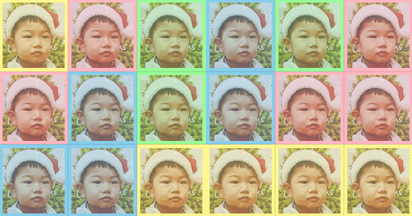

# [Touch-Color-Changing Tiles for Babies](../README.md#)

But the son looked for YouTube before long


### List

- [Touch-Color-Changing Tiles for Babies (2024.01.18)](#touch-color-changing-tiles-for-babies-20240118)


## [Touch-Color-Changing Tiles for Babies (2024.01.18)](#list)

- Features
  - Dynamic application of the number and size of cells
  - Color change while traversing a pastel tone palette with touch input
  - Apply the same `mousedown` and `touchstart` actions for smooth testing

- Future Improvements
  - Addition of more dynamic animation effects
  - Clear conditions such as color uniformity
  - Additional options such as the number of colors, cell size, and various photos

  

- Code
  <details>
    <summary>TouchColorChangingTiles.html</summary>

  ```html
  <!DOCTYPE html>

  <html lang="en">

  <head>
      <meta charset="UTF-8">
      <meta name="viewport" content="width=device-width, initial-scale=1.0">
      <link rel="stylesheet" href="TouchColorChangingTiles.css">
      <script defer src="TouchColorChangingTiles.js"></script>
      <title>Touch-Color-Changing Tiles for My Son</title>
  </head>

  <body>
      <canvas id="responsiveGridCanvas"></canvas>
  </body>

  </html>
  ```
  </details>
  <details>
    <summary>TouchColorChangingTiles.css</summary>

  ```css
  body, html {
      background-color: #333;
      margin: 0;
      padding: 0;
      overflow: hidden;
    }
  ```
  ```css
    canvas {
      display: block;
      margin: auto;
    }
  ```
  </details>
  <details>
    <summary>TouchColorChangingTiles.ts</summary>

  ```ts
  let firstRun: boolean = true;

  const canvas = document.getElementById('responsiveGridCanvas') as HTMLCanvasElement;
  const ctx = canvas.getContext('2d');

  const defaultCellSize = 120;                                // Default cell size
  let actualCellSizeX: number = defaultCellSize;
  let actualCellSizeY: number = defaultCellSize;
  const paddingPercentage = 0.05;                             // 5% padding on each side
  const sampleImageSrc = './Images/santa.jpg';                // Updated image path

  const pastelColors = [                                      // Pastel tone color palette
      '#FFB6C1', '#FFF68F', '#98FB98', '#87CEEB'
  ];
  const cellColors: string[][] = [];                          // 2D array to store the color of each cell

  const img = new Image();                                    // Image object
  img.src = sampleImageSrc;
  const sampleImageAlpha = 0.7;                               // Fixed transparency for the sample image
  ```
  ```ts
  img.onload = function () {
      updateCanvas();
  };
  ```
  ```ts
  function updateCanvas() {
      const numCols = Math.floor(window.innerWidth / defaultCellSize);
      const numRows = Math.floor(window.innerHeight / defaultCellSize);
      actualCellSizeX = window.innerWidth / numCols;
      actualCellSizeY = window.innerHeight / numRows;

      canvas.width = numCols * actualCellSizeX;
      canvas.height = numRows * actualCellSizeY;

      for (let y = 0; y < numRows; y += 1) {
          const rowColors: string[] = [];

          for (let x = 0; x < numCols; x += 1) {
              // Assign color
              if (firstRun) {
                  // Assign a random color
                  const randomColor = pastelColors[Math.floor(Math.random() * pastelColors.length)];
                  rowColors.push(randomColor);
                  ctx.fillStyle = randomColor;
              } else {
                  ctx.fillStyle = cellColors[y][x];
              }
              ctx.globalAlpha = 1; // Do not apply transparency to the background color
              ctx.fillRect(x * actualCellSizeX, y * actualCellSizeY, actualCellSizeX, actualCellSizeY);

              // Draw the sample image in the grid (apply fixed transparency)
              const paddingX = actualCellSizeX * paddingPercentage;
              const paddingY = actualCellSizeY * paddingPercentage;

              const resizedWidth = actualCellSizeX - 2 * paddingX;
              const resizedHeight = actualCellSizeY - 2 * paddingY;

              // Draw image with padding at the center of each cell
              const imgX = x * actualCellSizeX + paddingX;
              const imgY = y * actualCellSizeY + paddingY;
              ctx.globalAlpha = sampleImageAlpha;
              ctx.drawImage(img, imgX, imgY, resizedWidth, resizedHeight);
          }

          if (firstRun) {
              cellColors.push(rowColors);
          }
      }
      firstRun = false;
  }
  ```
  ```ts
  function handleInput(event: MouseEvent) {
      const clickedX = event.clientX - canvas.getBoundingClientRect().left;
      const clickedY = event.clientY - canvas.getBoundingClientRect().top;

      const colIndex = Math.floor(clickedX / actualCellSizeX);
      const rowIndex = Math.floor(clickedY / actualCellSizeY);

      // Change the palette order each time you click
      const currentColorIndex = pastelColors.findIndex(color => color === cellColors[rowIndex][colIndex]);
      const nextColorIndex = (currentColorIndex + 1) % pastelColors.length;

      // Only change the color of the selected cell
      cellColors[rowIndex][colIndex] = pastelColors[nextColorIndex];

      // Redraw only the selected cell
      ctx.fillStyle = cellColors[rowIndex][colIndex];
      ctx.globalAlpha = 1; // Do not apply transparency to the background color
      ctx.fillRect(colIndex * actualCellSizeX, rowIndex * actualCellSizeY, actualCellSizeX, actualCellSizeY);

      // Update the image
      img.src = sampleImageSrc;

      // // Log variables for debugging
      // console.log('actualCellSizeX:', actualCellSizeX);
      // console.log('actualCellSizeY:', actualCellSizeY);
      // console.log('clickedX:', clickedX);
      // console.log('clickedY:', clickedY);
      // console.log('colIndex:', colIndex);
      // console.log('rowIndex:', rowIndex);
      // console.log('currentColorIndex:', currentColorIndex);
      // console.log('nextColorIndex:', nextColorIndex);
      // console.log('cellColors:', cellColors);
  }
  ```
  ```ts
  canvas.addEventListener('mousedown', handleInput);
  canvas.addEventListener('touchstart', (event) => {
      event.preventDefault();
      handleInput(event);
  }, { passive: true });

  window.addEventListener('resize', () => {
      firstRun = true;
      updateCanvas();
  });
  ```
  </details>

- Sources
  - `sample.png` : [Child Head With Smiling Face Icon (OnlineWebFonts.COM)](https://www.onlinewebfonts.com/icon/57082)
