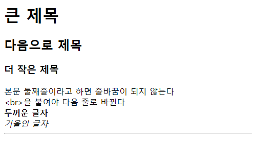

# [Web Lesson](/README.md#web-lesson)

For my sister


### \<List>

- [Lession 1 : HTML (2024.12.13)](#lession-1--html-20241213)


## [Lession 1 : HTML (2024.12.13)](#list)

- My sister suddenly wanted to learn Web Programming. Fortunately, she had a wonderful brother.
- I instructed her to first save a file with a `.html` extension in *Windows Notepad*, containing the minimal structure of an HTML document. Then, double-click to open it in a browser, and primarily modify the content within the `<body>` tag. By refreshing the browser, she could observe the changes and learn the basic functions.
- I also taught her how to generate code using LLMs.
- When I asked when she wanted to learn, her proactive attitude was impressive as she requested immediate remote instruction.

  

- Code
  <details>
    <summary>lesson_01.html</summary>

    ```html
    <html>
    <head>
      <title>여기가 탭 제목</title>
    </head>
    <body>
      <h1>큰 제목</h1>
      <h2>다음으로 제목</h2>
      <h3>더 작은 제목</h3>
      본문
      둘째줄이라고 하면 줄바꿈이 되지 않는다
      <br>&lt;br>을 붙여야 다음 줄로 바뀐다<br>
      <!-- 이건 주석이라 출력되지 않는다 -->
      <b>두꺼운 글자</b><br>
      <i>기울인 글자</i><br>
      <hr> <!-- 수평선 -->
    </body>
    </html>
    ```
  </details>
